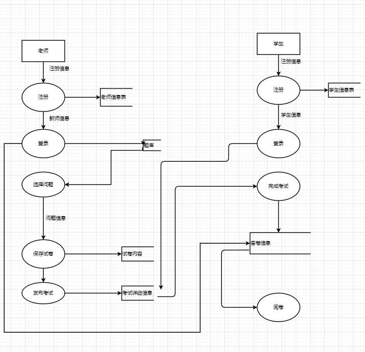

# 基于教考分离的考试系统设计与开发完整设计文档

[TOC]


## •数据模型设计


## •系统主要业务流程和逻辑设计（流程图、数据流流图、时序图等）



## •系统架构（框架、软件结构图）

#### 框架图：


#### 软件架构图：


## •系统性能设计指标（评估系统数据规模，用户规模，接口访问时延等）

1、数据规模: 

​	一个学期总共会开课300门左右，其中约有150多门课会进行考试。

2、用户规模: 

​	全校师生老师约12000名,其中学生大约11000名,老师大约1000名。

3、接口访问延时:

4、响应时间:用户应该在1s时间内得到服务器响应

5、更新处理时间:2秒,可能受网络状况影响。为保证数据的有效性,同一IP在两分钟内不允许提交两次

## •系统接口设计（基于前面实验改善后完成）

### 学生

### POST 注册

POST /student/register

> Body 请求参数

```json
{
  "name": "string",
  "stuNo": 0,
  "password": 0
}
```

#### 请求参数

| 名称       | 位置 | 类型    | 必选 | 说明 |
| ---------- | ---- | ------- | ---- | ---- |
| body       | body | object  | 否   | none |
| » name     | body | string  | 是   | 姓名 |
| » stuNo    | body | integer | 是   | 学号 |
| » password | body | integer | 是   | 密码 |

> 返回示例

#### 返回结果

| 状态码 | 状态码含义                                              | 说明 | 数据模型 |
| ------ | ------------------------------------------------------- | ---- | -------- |
| 200    | [OK](https://tools.ietf.org/html/rfc7231#section-6.3.1) | 成功 | Inline   |

#### 返回数据结构

### POST 登录

POST /student/login

> Body 请求参数

```json
{
  "stuNo": 0,
  "password": 0
}
```

#### 请求参数

| 名称       | 位置 | 类型    | 必选 | 说明 |
| ---------- | ---- | ------- | ---- | ---- |
| body       | body | object  | 否   | none |
| » stuNo    | body | integer | 是   | 学号 |
| » password | body | integer | 是   | 密码 |

> 返回示例

#### 返回结果

| 状态码 | 状态码含义                                              | 说明 | 数据模型 |
| ------ | ------------------------------------------------------- | ---- | -------- |
| 200    | [OK](https://tools.ietf.org/html/rfc7231#section-6.3.1) | 成功 | Inline   |

#### 返回数据结构

### 老师

### POST 注册

POST /teacher/register

> Body 请求参数

```json
{
  "name": "string",
  "teaNo": 0,
  "password": 0
}
```

#### 请求参数

| 名称       | 位置 | 类型    | 必选 | 说明     |
| ---------- | ---- | ------- | ---- | -------- |
| body       | body | object  | 否   | none     |
| » name     | body | string  | 是   | 姓名     |
| » teaNo    | body | integer | 是   | 教师编号 |
| » password | body | integer | 是   | 密码     |

> 返回示例

#### 返回结果

| 状态码 | 状态码含义                                              | 说明 | 数据模型 |
| ------ | ------------------------------------------------------- | ---- | -------- |
| 200    | [OK](https://tools.ietf.org/html/rfc7231#section-6.3.1) | 成功 | Inline   |

#### 返回数据结构

### POST 登录

POST /teacher/login

> Body 请求参数

```json
{
  "teaNo": 0,
  "password": 0
}
```

#### 请求参数

| 名称       | 位置 | 类型    | 必选 | 说明     |
| ---------- | ---- | ------- | ---- | -------- |
| body       | body | object  | 否   | none     |
| » teaNo    | body | integer | 是   | 教师编号 |
| » password | body | integer | 是   | 密码     |

> 返回示例

#### 返回结果

| 状态码 | 状态码含义                                              | 说明 | 数据模型 |
| ------ | ------------------------------------------------------- | ---- | -------- |
| 200    | [OK](https://tools.ietf.org/html/rfc7231#section-6.3.1) | 成功 | Inline   |

#### 返回数据结构

### 考试

### POST 发布考试

POST /exam/post

> Body 请求参数

```json
{
  "model_id": 0,
  "teacherName": "string",
  "startTime": "string",
  "endTime": "string",
  "limitCome": "string",
  "limitSubmit": "string"
}
```

#### 请求参数

| 名称          | 位置 | 类型    | 必选 | 说明         |
| ------------- | ---- | ------- | ---- | ------------ |
| body          | body | object  | 否   | none         |
| » model_id    | body | integer | 是   | 考卷编号     |
| » teacherName | body | string  | 是   | 老师姓名     |
| » startTime   | body | string  | 是   | 开始时间     |
| » endTime     | body | string  | 是   | 结束时间     |
| » limitCome   | body | string  | 是   | 限制进入时间 |
| » limitSubmit | body | string  | 是   | 限制提交时间 |

> 返回示例

#### 返回结果

| 状态码 | 状态码含义                                              | 说明 | 数据模型 |
| ------ | ------------------------------------------------------- | ---- | -------- |
| 200    | [OK](https://tools.ietf.org/html/rfc7231#section-6.3.1) | 成功 | Inline   |

#### 返回数据结构

### POST 删除考试

POST /exam/delete

> Body 请求参数

```json
{
  "id": 0
}
```

#### 请求参数

| 名称 | 位置 | 类型    | 必选 | 说明     |
| ---- | ---- | ------- | ---- | -------- |
| body | body | object  | 否   | none     |
| » id | body | integer | 是   | 考试编号 |

> 返回示例

#### 返回结果

| 状态码 | 状态码含义                                              | 说明 | 数据模型 |
| ------ | ------------------------------------------------------- | ---- | -------- |
| 200    | [OK](https://tools.ietf.org/html/rfc7231#section-6.3.1) | 成功 | Inline   |

#### 返回数据结构

### POST 批阅考卷

POST /exam/check

> Body 请求参数

```json
{}
```

#### 请求参数

| 名称 | 位置 | 类型   | 必选 | 说明 |
| ---- | ---- | ------ | ---- | ---- |
| body | body | object | 否   | none |

> 返回示例

#### 返回结果

| 状态码 | 状态码含义                                              | 说明 | 数据模型 |
| ------ | ------------------------------------------------------- | ---- | -------- |
| 200    | [OK](https://tools.ietf.org/html/rfc7231#section-6.3.1) | 成功 | Inline   |

#### 返回数据结构

### POST 完成考试

POST /exam/finish

> Body 请求参数

```json
{
  "studentId": 0,
  "examid": 0,
  "finish": [
    {
      "questionId": 0,
      "questionType": 0,
      "answer": [
        0
      ]
    }
  ]
}
```

#### 请求参数

| 名称            | 位置 | 类型      | 必选 | 说明     |
| --------------- | ---- | --------- | ---- | -------- |
| body            | body | object    | 否   | none     |
| » studentId     | body | integer   | 是   | 学生编号 |
| » examid        | body | integer   | 是   | 考试编号 |
| » finish        | body | [object]  | 是   | 学生作答 |
| »» questionId   | body | integer   | 是   | 题目编号 |
| »» questionType | body | integer   | 是   | 题目类型 |
| »» answer       | body | [integer] | 是   | 答案     |

> 返回示例

#### 返回结果

| 状态码 | 状态码含义                                              | 说明 | 数据模型 |
| ------ | ------------------------------------------------------- | ---- | -------- |
| 200    | [OK](https://tools.ietf.org/html/rfc7231#section-6.3.1) | 成功 | Inline   |

#### 返回数据结构

### 课程

### POST 老师加入课程

POST /toTeacher

> Body 请求参数

```json
{
  "courseName": "string",
  "teacherName": "string"
}
```

#### 请求参数

| 名称          | 位置 | 类型   | 必选 | 说明     |
| ------------- | ---- | ------ | ---- | -------- |
| body          | body | object | 否   | none     |
| » courseName  | body | string | 是   | 课程名称 |
| » teacherName | body | string | 是   | 老师姓名 |

> 返回示例

#### 返回结果

| 状态码 | 状态码含义                                              | 说明 | 数据模型 |
| ------ | ------------------------------------------------------- | ---- | -------- |
| 200    | [OK](https://tools.ietf.org/html/rfc7231#section-6.3.1) | 成功 | Inline   |

#### 返回数据结构

### POST 学生加入课程

POST /toStu

> Body 请求参数

```json
{
  "courseName": "string",
  "studentName": "string"
}
```

#### 请求参数

| 名称          | 位置 | 类型   | 必选 | 说明     |
| ------------- | ---- | ------ | ---- | -------- |
| body          | body | object | 否   | none     |
| » courseName  | body | string | 是   | 课程名称 |
| » studentName | body | string | 是   | 学生名称 |

> 返回示例

#### 返回结果

| 状态码 | 状态码含义                                              | 说明 | 数据模型 |
| ------ | ------------------------------------------------------- | ---- | -------- |
| 200    | [OK](https://tools.ietf.org/html/rfc7231#section-6.3.1) | 成功 | Inline   |

#### 返回数据结构

### POST 新增课程

POST /add

> Body 请求参数

```json
{
  "name": "string",
  "describe": "string"
}
```

#### 请求参数

| 名称       | 位置 | 类型   | 必选 | 说明     |
| ---------- | ---- | ------ | ---- | -------- |
| body       | body | object | 否   | none     |
| » name     | body | string | 是   | 课程名称 |
| » describe | body | string | 是   | 课程描述 |

> 返回示例

#### 返回结果

| 状态码 | 状态码含义                                              | 说明 | 数据模型 |
| ------ | ------------------------------------------------------- | ---- | -------- |
| 200    | [OK](https://tools.ietf.org/html/rfc7231#section-6.3.1) | 成功 | Inline   |

#### 返回数据结构

### 考卷

### POST 创建考卷

POST /model/create

> Body 请求参数

```json
{
  "name": "string",
  "status": "string",
  "content": [
    {
      "name": "string",
      "questionType": 0,
      "option": [
        "string"
      ]
    }
  ]
}
```

#### 请求参数

| 名称            | 位置  | 类型     | 必选 | 说明         |
| --------------- | ----- | -------- | ---- | ------------ |
| id              | query | string   | 否   | 考卷编号     |
| name            | query | string   | 否   | 考卷名称     |
| status          | query | string   | 否   | 考卷当前状态 |
| content         | query | string   | 否   | 考卷内容     |
| body            | body  | object   | 否   | none         |
| » name          | body  | string   | 是   | 考卷名称     |
| » status        | body  | string   | 是   | 考卷状态     |
| » content       | body  | [object] | 是   | 考卷内容     |
| »» name         | body  | string   | 是   | 题目         |
| »» questionType | body  | integer  | 是   | 题目类型     |
| »» option       | body  | [string] | 是   | 选项         |

> 返回示例

#### 返回结果

| 状态码 | 状态码含义                                              | 说明 | 数据模型 |
| ------ | ------------------------------------------------------- | ---- | -------- |
| 200    | [OK](https://tools.ietf.org/html/rfc7231#section-6.3.1) | 成功 | Inline   |

#### 返回数据结构

### POST 删除考卷

POST /model/delete

> Body 请求参数

```json
{
  "eid": 0
}
```

#### 请求参数

| 名称  | 位置 | 类型    | 必选 | 说明     |
| ----- | ---- | ------- | ---- | -------- |
| body  | body | object  | 否   | none     |
| » eid | body | integer | 是   | 考卷编号 |

> 返回示例

#### 返回结果

| 状态码 | 状态码含义                                              | 说明 | 数据模型 |
| ------ | ------------------------------------------------------- | ---- | -------- |
| 200    | [OK](https://tools.ietf.org/html/rfc7231#section-6.3.1) | 成功 | Inline   |

#### 返回数据结构

### POST 查看考卷

POST /model/check

> Body 请求参数

```json
{
  "examId": 0
}
```

#### 请求参数

| 名称     | 位置 | 类型    | 必选 | 说明     |
| -------- | ---- | ------- | ---- | -------- |
| body     | body | object  | 否   | none     |
| » examId | body | integer | 是   | 考卷编号 |

> 返回示例

#### 返回结果

| 状态码 | 状态码含义                                              | 说明 | 数据模型 |
| ------ | ------------------------------------------------------- | ---- | -------- |
| 200    | [OK](https://tools.ietf.org/html/rfc7231#section-6.3.1) | 成功 | Inline   |

#### 返回数据结构

### POST 编辑考卷

POST /model/modify

> Body 请求参数

```json
{
  "id": 0,
  "name": "string",
  "content": [
    {
      "name": "string",
      "questionType": 0,
      "option": [
        "string"
      ]
    }
  ]
}
```

#### 请求参数

| 名称            | 位置 | 类型     | 必选 | 说明     |
| --------------- | ---- | -------- | ---- | -------- |
| body            | body | object   | 否   | none     |
| » id            | body | integer  | 是   | 考卷编号 |
| » name          | body | string   | 是   | 考卷名称 |
| » content       | body | [object] | 是   | 考卷内容 |
| »» name         | body | string   | 是   | 题目     |
| »» questionType | body | integer  | 是   | 题目类型 |
| »» option       | body | [string] | 是   | 选项     |

> 返回示例

#### 返回结果

| 状态码 | 状态码含义                                              | 说明 | 数据模型 |
| ------ | ------------------------------------------------------- | ---- | -------- |
| 200    | [OK](https://tools.ietf.org/html/rfc7231#section-6.3.1) | 成功 | Inline   |

#### 返回数据结构

### 题库

### POST 新增题目

POST /quiz/add

> Body 请求参数

```json
{
  "name": "string",
  "questionType": 0,
  "option": [
    "string"
  ]
}
```

#### 请求参数

| 名称           | 位置 | 类型     | 必选 | 说明           |
| -------------- | ---- | -------- | ---- | -------------- |
| body           | body | object   | 否   | none           |
| » name         | body | string   | 是   | 题目           |
| » questionType | body | integer  | 是   | 题目类别       |
| » option       | body | [string] | 是   | 选项（有需要） |

> 返回示例

#### 返回结果

| 状态码 | 状态码含义                                              | 说明 | 数据模型 |
| ------ | ------------------------------------------------------- | ---- | -------- |
| 200    | [OK](https://tools.ietf.org/html/rfc7231#section-6.3.1) | 成功 | Inline   |

#### 返回数据结构

### POST 删除题目

POST /quiz/delete

> Body 请求参数

```json
{
  "quesId": 0
}
```

#### 请求参数

| 名称     | 位置 | 类型    | 必选 | 说明     |
| -------- | ---- | ------- | ---- | -------- |
| body     | body | object  | 否   | none     |
| » quesId | body | integer | 是   | 题目编号 |

> 返回示例

#### 返回结果

| 状态码 | 状态码含义                                              | 说明 | 数据模型 |
| ------ | ------------------------------------------------------- | ---- | -------- |
| 200    | [OK](https://tools.ietf.org/html/rfc7231#section-6.3.1) | 成功 | Inline   |

#### 返回数据结构

### POST 查找题目

POST /quiz/check

> Body 请求参数

```json
{
  "id": 0
}
```

#### 请求参数

| 名称 | 位置 | 类型    | 必选 | 说明     |
| ---- | ---- | ------- | ---- | -------- |
| body | body | object  | 否   | none     |
| » id | body | integer | 是   | 题目编号 |

> 返回示例

#### 返回结果

| 状态码 | 状态码含义                                              | 说明 | 数据模型 |
| ------ | ------------------------------------------------------- | ---- | -------- |
| 200    | [OK](https://tools.ietf.org/html/rfc7231#section-6.3.1) | 成功 | Inline   |

#### 返回数据结构

### POST 修改题目

POST /exam/modify

> Body 请求参数

```json
{
  "id": 0,
  "name": "string",
  "questionType": 0,
  "option": [
    "string"
  ]
}
```

#### 请求参数

| 名称           | 位置 | 类型     | 必选 | 说明                   |
| -------------- | ---- | -------- | ---- | ---------------------- |
| body           | body | object   | 否   | none                   |
| » id           | body | integer  | 是   | 题目编号               |
| » name         | body | string   | 是   | 题目名称               |
| » questionType | body | integer  | 是   | 题目类型               |
| » option       | body | [string] | 是   | 题目选项（单选与多选） |

> 返回示例

#### 返回结果

| 状态码 | 状态码含义                                              | 说明 | 数据模型 |
| ------ | ------------------------------------------------------- | ---- | -------- |
| 200    | [OK](https://tools.ietf.org/html/rfc7231#section-6.3.1) | 成功 | Inline   |

#### 返回数据结构

### 数据模型


## •系统硬件配置要求（系统运行需要的主机配置，软件配置）

#### 计算机：

安装数据库Navicat for MySQL5.0及以上，window7及以上的操作系统。

#### 移动端：

1.安卓手机：系统要求：安卓6.0以上系统适用  
2.iPhone：系统要求：iPhone8.1-iPhone15.0以上系统适用
3.ipad：系统要求：iPad8.1-iPad15.0以上系统适用
4.windows phone8版手机：系统要求：Windows Phone8.0以上系统适用

## •系统设计的难点及待解决问题（设计过程中的难点和待解决问题）

难点:

对考试过程进行各项参数设置，包括考试发放对象、基本信息设置（考试时间、答题时长、限时进入、限时提交、考试批次、考试场次）

支持生生互评等批阅方式

## •系统设计的分工

| 学号     | 姓名   | 分工                                                         |
| -------- | ------ | ------------------------------------------------------------ |
| 31901047 | 倪斌华 | 软件架构设计图、接口设计，题库与考卷模版代码实现，成绩管理。 |
| 31901050 | 饶黎明 | ER图、时序图、接口设计，考试管理代码实现，阅卷实现。         |

1、题库实现**分类管理**、**题库建设**、**题库个性化管理**、题库安全管理和审批管理。需支持包括单选、多选、填空、判断、名词解析、论述、计算、分录、资料、连线、投票、排序、完形填空、阅读理解、综合、口语、听力、程序等多种题型；（实现4种题型吧）。

2、试卷管理提供手动组卷和智能组卷方式，可以对已创建的试卷进行封存、预览、编辑、复制、发布考试、删除、分配教师等管理操作；（存，看，改，复制，发布，删，分配）。

3、考试发布管理可以对考试过程进行各项参数设置，包括考试发放对象、基本信息设置（考试时间、答题时长、限时进入、限时提交、考试批次、考试场次）、高级设置和考试通知发放；

4、考试管理模块可以查看未开始、进行中、已结束的所有考试，以列表形式呈现。针对每次考试可以进行查看考试详情、管理考生、在线监考、管理监考老师、批阅试卷以及删除考试等操作。同时监考数据支持导出，可用于数据分析及存档； 

5、阅卷管理模块提供个性化阅卷设置，系统可以实现客观题自动批阅，主观题由阅卷老师批阅，同时支持生生互评等批阅方式，提高阅卷效率，有效减轻阅卷老师工作量，满足不同形式的阅卷需求。阅卷后成绩自动记录，支持成绩导出、试卷导出、考试附件打包导出、数据存档等功能，方便再次使用；

6、成绩管理模块支持对线上成绩和线下成绩的管理；